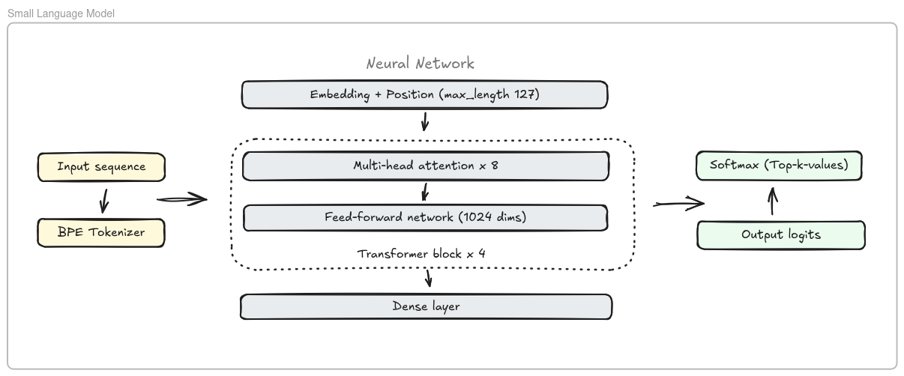
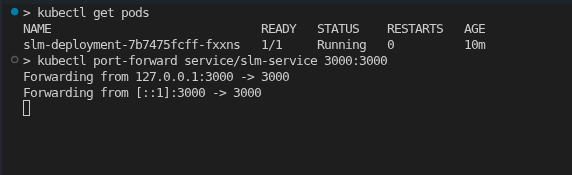

# Project Overview: Small Language Model

> [!NOTE]
> Disclaimer: This project has been developed to meet the requirements of the Machine Learning Zoomcamp capstone-2 assignment.



## Problem Description
This project focuses on building a **Small Language Model (SLM)** from scratch using a decoder-only Transformer architecture. While large-scale models require massive infrastructure, this project demonstrates that a specialized, compact model can effectively learn language structures and narrative patterns when trained on a high-quality, synthetic dataset. The goal is to generate coherent short stories using a model that is efficient enough for local inference.


## Dataset Description
The model is trained on the TinyStories dataset from HuggingFace.

- **Source**: `roneneldan/TinyStories`.
- **Subset used**: The first 20,000 samples from the training split.
- **Content**: Short, simple stories designed for small models to learn basic English grammar and reasoning.
- **Preprocessing**: Texts are cleaned of extra whitespace and appended with a <|endoftext|> token.


## Exploratory Data Analysis (EDA)
The EDA phase (documented in the notebook) includes:

- **Length Analysis**: Calculation of character and word lengths, showing a median story length and identifying the 95th percentile to determine optimal sequence limits.
- **Zipf's Law Visualization**: A Log-Log plot of token frequencies to confirm the vocabulary distribution follows standard linguistic patterns.
- **Token Distribution**: Analysis of story lengths in tokens to set the MAX_SEQ_LEN to 128.


## Model Training
The model is a `Decoder-only Transformer` implemented using the Keras/TensorFlow framework.

### Hyperparameter Tuning

A grid search was conducted to optimize the model's performance by testing combinations of learning rates and feed-forward dimensions:

- **Learning Rates**: [1e-4, 5e-4]
- **Feed-Forward Dimensions (FF_DIM)**: [512, 1024]

### Final Model Configuration

The final architecture uses the following optimized parameters:

- **Vocabulary Size**: 4096 (Byte-Level BPE)
- **Sequence Length (MAX_LEN)**: 127
- **Embedding Dimension**: 256
- **Attention Heads**: 8
- **Transformer Layers**: 4
- **Precision**: mixed_float16 for optimized GPU performance.


## Dependencies
The project relies on the following key libraries:

- `tensorflow` & `keras` (v3 backend)
- `tokenizers` (HuggingFace Byte-Level BPE)
- `datasets` (HuggingFace)
- `onnx`, `tf2onnx`, `onnxruntime`
- `pandas`, `numpy`, `seaborn`, `matplotlib`

### Installation Guide
> `uv` must be installed first to synchronize the project dependencies.

**Mac & Linux**
```
curl -LsSf https://astral.sh/uv/install.sh | sh
```
**Windows**
```
powershell -ExecutionPolicy ByPass -c "irm https://astral.sh/uv/install.ps1 | iex"
```

> Install all project dependencies using:
```
uv sync
```

> Activate the virtual environment:
```
source .venv/bin/activate
```


## Scripts
`train.py`: Execute this script to train the model from scratch without requiring a notebook environment.
```bash
python train.py
```

`test.py`: A utility script used to test the functionality and response of the `/generate` endpoint.
```bash
python test.py
```


## Reproducibility
The project is designed to be accessible and reproducible across different environments:

- **Google Colab**: The project was originally developed and tested in a Colab environment.

- **Local Environment**: For local execution, it is recommended to use uv for high-performance dependency management.
    - Install dependencies: `uv sync`
    - Run the training: `python train.py`

- **Dataset**: The script automatically fetches the roneneldan/TinyStories dataset from HuggingFace.


## Model Deployment
The model is served as a high-performance web service:

- **Framework**: Built with `Axum`, a modular and performant web framework for Rust.
- **Inference Engine**: Powered by `ONNX Runtime (ORT)` for efficient CPU/GPU execution.
- **Endpoint**: The model exposes a `/generate` endpoint for text completion and story generation.

### Deployment Recommendation: Why Docker?

It is highly recommended to deploy and run this project using the provided Docker environment. Containerization is used here to overcome two significant hurdles:

- C++ Dependency Issues: The ONNX Runtime (ORT) and its Rust bindings rely heavily on specific C++ toolchains and system-level libraries (like libonnxruntime.so) that can be difficult to configure manually on different operating systems.

- Heavy Setup Requirements: A manual installation requires setting up the Rust toolchain, C++ compilers, and specific environment variables for ONNX.

### Verifying the Deployment

Once the container is running, you can verify the deployment by running the provided test script. This script sends a prompt to the API and validates the generated response:
```bash
python test.py
```


## Containerization
The project is fully containerized for consistent deployment:

- **Docker**: A Dockerfile is included to package the application and its ONNX runtime environment.
- **Orchestration**: A docker-compose.yml file is provided to manage the service.
- **Usage**: To build and start the entire stack, simply run in the project directory:

    ```bash
    docker compose up --build
    ```

## Cloud Deployment
For this project, local Kubernetes via kind (Kubernetes in Docker) is used to simulate a cloud environment. This setup allows for testing production-grade orchestration, resource limits, and service networking.

### Local Kubernetes Workflow with kind
To deploy the small language model service to a local cluster, follow these steps:

- Create the Cluster: Initialize a new cluster named slm-cluster:
    ```
    kind create cluster --name slm-cluster
    ```

- Build the Docker Image: Build the image locally:
    ```
    docker build -t mlz-slm:latest .
    ```

- Load Image into kind: Manually load the local image into the cluster nodes:
    ```
    kind load docker-image mlz-slm:latest --name slm-cluster
    ```

- Deploy to Kubernetes: Apply the deployment to the cluster:
    ```
    kubectl apply -f slm-k8s-deployment.yaml
    ```

- Verify Status: Check that your pods are running and healthy:
    ```
    kubectl get pods
    ```
        

- Access the API: Forward the service port to interact with the /generate endpoint:
    ```
    kubectl port-forward service/slm-service 3000:3000
    ```

- Cleanup: Once testing is complete, delete the cluster:
    ```
    kind delete cluster --name slm-cluster
    ```


## Acknowledgements

I would like to thank **Alexey Grigorev** for the excellent course content and guidance provided through the Machine Learning Zoomcamp, which played a key role in shaping and completing this project.